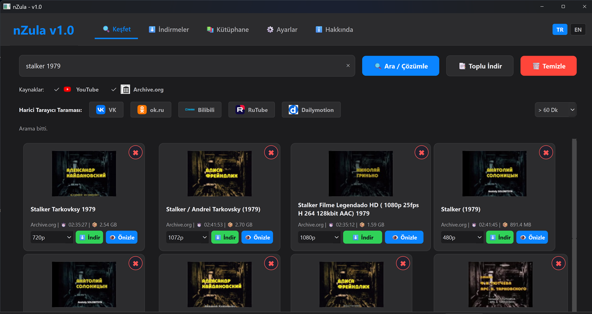
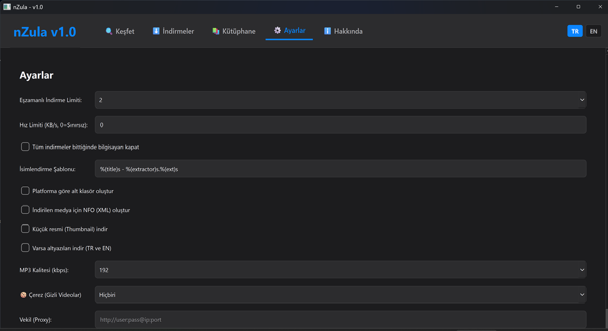

# nZula v1.0 - Medya Arşivleme Terminali

nZula, sinema ve medya arşivcileri için geliştirilmiş; pano (clipboard) takibi, harici platform yönlendirmesi, otomatik metadata üretimi, altyazı indirme ve NFO oluşturma özelliklerine sahip, iş akışı odaklı bir medya indirme terminalidir.

---




## 🛠 İş Akışı ve Özellikler

### 🔎 Yerel ve Harici Yönlendirmeli Arama

- **YouTube** ve **Archive.org** aramaları doğrudan uygulama içerisinden gerçekleştirilir.
- Arama motoru kısıtlamaları bulunan kapalı platformlar (**VK**, **OK.ru**, **RuTube**, **Bilibili**, **Dailymotion**) için arayüzde özel yönlendirme butonları bulunur.
- Bu butonlar kullanıcıyı doğrudan ilgili platformun kendi arama sayfasına yönlendirir.

### 📋 Otomatik Pano Yakalama (Clipboard Integration)

Tarayıcıda görüntülenen desteklenen bir video bağlantısı kopyalandığında;

- URL otomatik olarak algılanır.
- Geçerliliği doğrulanır.
- İndirme kuyruğuna eklenir.

### 🍪 Oturum ve Çerez Yönetimi

İsteğe bağlı olarak yerel tarayıcı çerezleri (`--cookies-from-browser`) kullanılarak;

- yaş kısıtlamalı içerikler,
- oturum gerektiren servisler,
- giriş doğrulaması isteyen platformlar

desteklenebilir.

### 📝 Metadata, Altyazı ve NFO

Her indirilen medya için otomatik olarak;

- altyazı (`.srt`) (opsiyonel)
- metadata
- Plex/Kodi uyumlu `.nfo`

dosyaları oluşturulur.

### 🗄 Veritabanı ve Geçmiş

Tüm indirme kayıtları SQLite veritabanında saklanır.

```sql
UNIQUE(url, file_path)
```

şeması sayesinde aynı dosyanın tekrar oluşturulması veya üzerine yazılması engellenir.

### ⚡ Asenkron İşlemci

- Çoklu indirme
- Kuyruk yönetimi
- Arka plan işlemleri

tamamen asenkron çalışır ve arayüzün kilitlenmesini önler.

---

# 🚀 Hızlı Başlangıç

1. **Releases** sayfasına gidin.
2. En son yayınlanan **.exe** dosyasını indirin.
3. Programı çalıştırın.
4. Arşivlemeye başlayın.

---

# 💻 Geliştiriciler İçin

Projeyi kaynak koddan çalıştırmak isterseniz:

## Depoyu klonlayın

```bash
git clone https://github.com/nutuzar/nZula.git
```

## Gerekli paketleri yükleyin

```bash
pip install -r requirements.txt
```

## Uygulamayı çalıştırın

```bash
python main.py
```

---

# nZula v1.0 - Media Archiving Terminal

nZula is a workflow-oriented media archiving and download terminal designed for cinema archivists, featuring smart clipboard tracking, external platform routing, automatic subtitle retrieval, metadata generation, and Plex/Kodi-compatible NFO creation.

---

## 🛠 Workflow & Features

### 🔎 Native & Routed Search

- Direct in-app search for **YouTube** and **Archive.org**.
- Integrated routing buttons for restricted platforms including **VK**, **OK.ru**, **RuTube**, **Bilibili**, and **Dailymotion**.
- Opens each platform's native search page directly in the user's browser.

### 📋 Automated Clipboard Tracking

When a supported video URL is copied:

- the background clipboard listener detects it,
- validates the address,
- automatically adds it to the download queue.

### 🍪 Session & Cookie Integration

Optionally uses local browser cookies (`--cookies-from-browser`) to access:

- age-restricted content,
- authenticated services,
- login-protected platforms.

### 📝 Metadata, Subtitles & NFO

Automatically generates:

- subtitles (`.srt`)
- structured metadata
- Plex/Kodi-compatible `.nfo` files

for every downloaded media item.

### 🗄 Database Management

Download history is stored inside an SQLite database.

```sql
UNIQUE(url, file_path)
```

prevents duplicate records and accidental file overwrites.

### ⚡ Asynchronous Processing

Supports:

- concurrent downloads,
- asynchronous queue management,
- non-blocking background processing.

---

# 🚀 Quick Start

1. Go to the **Releases** page.
2. Download the latest **.exe** release.
3. Run the application.
4. Start archiving.

---

# 💻 For Developers

Clone the repository:

```bash
git clone https://github.com/nutuzar/nZula.git
```

Install dependencies:

```bash
pip install -r requirements.txt
```

Run the application:

```bash
python main.py
```